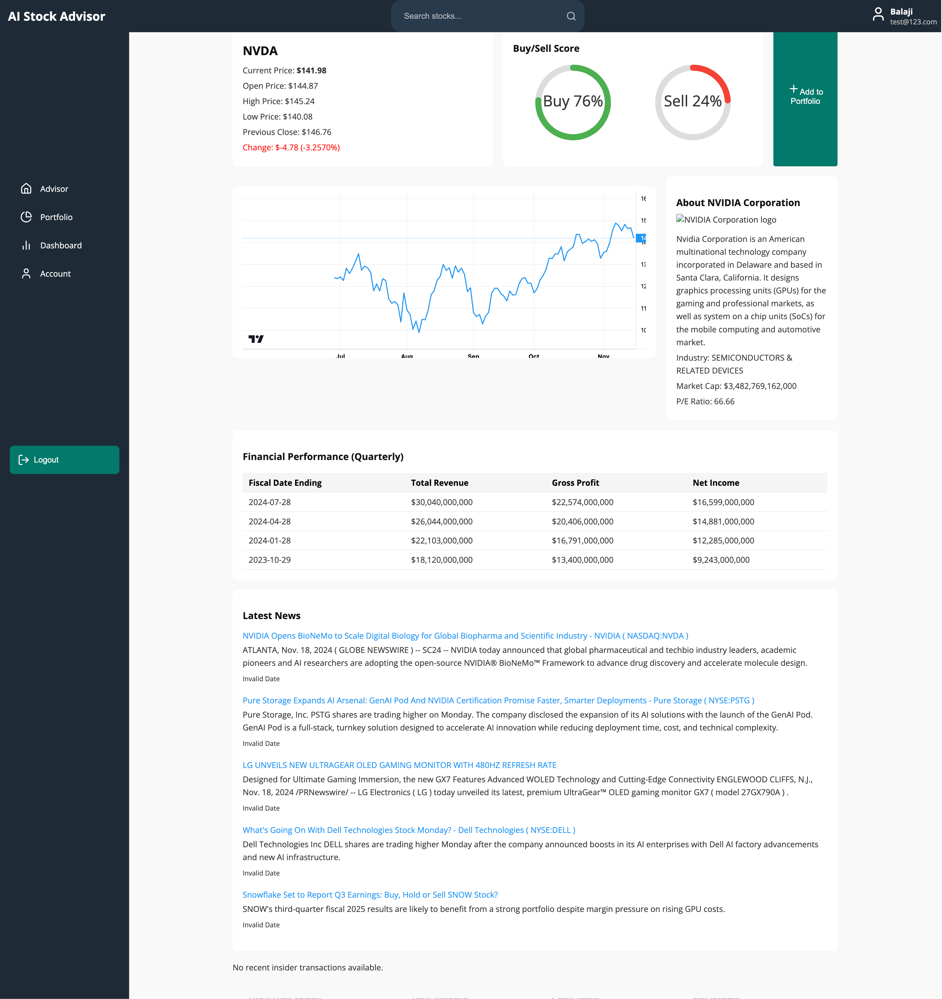

## **AI-Stock Advisor System** 🚀  

### **Overview**  
AI-Stock Advisor System is an AI-powered stock market analysis platform that provides **real-time insights, trend predictions, and financial analytics** using **LangChain agents, Nvidia NIM models, and Retrieval-Augmented Generation (RAG)**. It integrates **live stock data, financial reports, and AI-powered chat interactions** to help users make informed investment decisions.  


This system features:  
✅ **Live stock data retrieval** (from APIs like Alpha Vantage, FinnHub, FMP)  
✅ **AI-powered financial insights** using LangChain agents and Nvidia NIM  
✅ **Retrieval-Augmented Generation (RAG)** for context-aware responses  
✅ **User authentication & portfolio management** (Azure Cosmos DB)  
✅ **Seamless CI/CD pipeline & cloud deployment** (Docker, GitHub Actions, Heroku)  


---

### **Tech Stack**  

#### **Frontend (React.js) [🔗 GitHub Repo](https://github.com/asish-kun/AI-Financial-Advisor-UI)**
- **Minimal & responsive UI** for intuitive stock analysis  
- **Real-time stock visualization** with interactive charts  
- **Chatbot interface** for AI-driven insights  

#### **Backend (Flask API) [🔗 GitHub Repo](https://github.com/asish-kun/AI-Financial-Advisor)**
- **API for stock data, authentication, AI responses**  
- **Orchestrates LangChain Agents** (Crew-based AI model)  
- **Fetches & processes live stock data** from Alpha Vantage, FinnHub, and FMP  

#### **AI Model Server [🔗 GitHub Repo](https://github.com/siddu2484/BTP_GEN_AI)**
- **Nvidia NIM-powered AI models** for advanced financial text embeddings
- **Langchain Agents** for orchestrating tasks  
- **ChromaDB integration** for storing financial embeddings  
- **Handles financial query understanding & document similarity matching**  

---

### **Architecture** 🏗  

1️⃣ **User Input**: Users search for stocks or ask financial questions via the chatbot.  
2️⃣ **Data Retrieval**: Crew Agents fetch **live stock prices, trends, news & financials** from APIs.  
3️⃣ **AI Processing**:  
   - **Nvidia NIM** creates embeddings for financial documents.  
   - **ChromaDB** retrieves the most relevant info for user queries.  
   - **LangChain Agents** generate AI-powered financial insights.  
4️⃣ **Response Generation**: The AI synthesizes the information into **clear, actionable insights** and sends it to the frontend.  

🚀 **Deployed via Docker, Netlify (Frontend), and Heroku (Backend) with CI/CD automation.**  

---

### **Key Features**  
✅ **AI-Powered Chatbot** – Get stock advice in natural language  
✅ **Real-Time Data** – Fetches stock quotes, earnings reports, and market trends  
✅ **Portfolio Management** – Track & analyze personal investments  
✅ **Retrieval-Augmented Generation (RAG)** – AI answers grounded in real financial data  
✅ **Secure Authentication** – Built with Azure Cosmos DB & Flask sessions  

---

### **Application Screen UI**

**Landing Page** 


**Home Screen View** 


**Advisor Chat View** 


**Portfolio Management View** 


**Stock Details View** 


---

### **Setup & Deployment**  
**Run Locally (Dockerized)**  
```bash
# Clone repositories
git clone https://github.com/asish-kun/AI-Financial-Advisor-UI.git # Frontend  
git clone https://github.com/asish-kun/AI-Financial-Advisor.git # Backend  
git clone https://github.com/siddu2484/BTP_GEN_AI.git # AI Model Server  

# Start backend
cd AI-Financial-Advisor
docker build -t ai-advisor-backend .
docker run -p 5000:5000 ai-advisor-backend

# Start frontend
cd ../AI-Financial-Advisor-UI
npm install
npm start
```

For **production**, the backend is deployed on **Heroku**, the frontend on **Netlify**, and the AI models on **a dedicated GPU-based cloud instance**.

---

### **Future Enhancements** 🔮  
🚀 **Advanced AI Agents** (Adding Technical & Fundamental Analysis Agents)  
📈 **Predictive AI Models** (LSTMs, ARIMA for stock forecasting)  
🛠 **Scalability Improvements** (Kubernetes deployment for high-load environments)  

---

### **Contributors & Credits**  
Built by **Asish Nelapati, Siddartha Swaroop**, leveraging cutting-edge AI, cloud, and financial APIs.  

🛠 Want to contribute? Fork & submit a PR!  

📫 Questions? Open an **issue** or reach out to **asish.nelapati@gmail.com**.  

**[Try it out now!](https://github.com/asish-kun/AI-Financial-Advisor-UI)**
